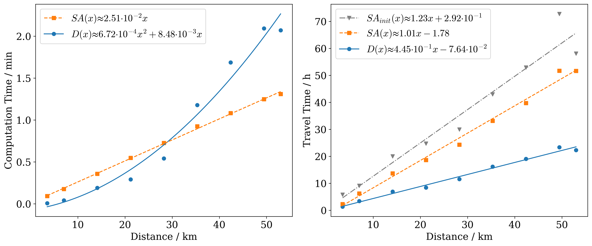
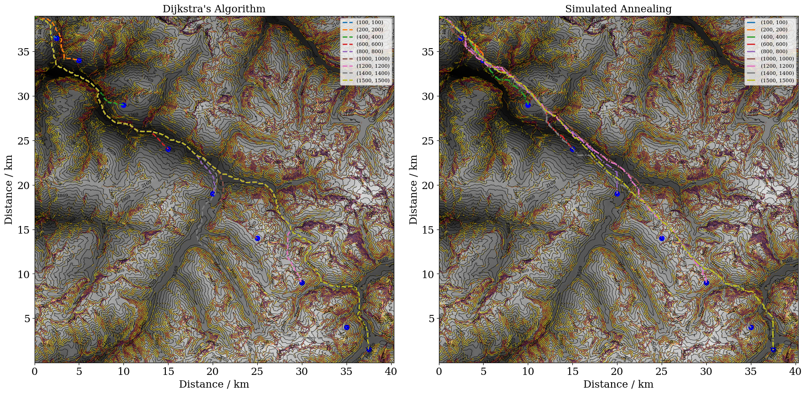

# CO3-skitour-optimization

### Simulated Annealing vs Dijkstra – Computation Time

## Usage

Run from project root:

```bash
pip install -e .

Then run the individual scripts such as:

```bash
python scripts/sa_vs_dijk_time_plot.py

to obtain its results:



and 



and similarly for accuracy.py, plot_comparison_3.py, robustness.py and sa_training.py


